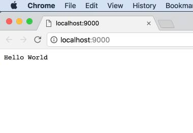

# YunpNodeServer
YunpNodeServer是一个简单的Nodejs应用服务器，是《[云加JavaScript](https://yunp.top/init/course/v/1)》用于全栈教学的课堂实现。

## 安装

```shell
npm install yunpnodeserver
```

## Hello World
main.js 内容如下：  

```javascript
const Server = require("yunpnodeserver");

let s = new Server();
s.serve();

s.addPage("/", (req, res) => {
    res.end("Hello World");
});

```

## 运行

```shell
node main.js
```

## 查看效果

访问地址： http://localhost:9000   
效果如下：  

